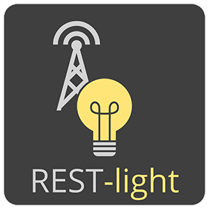

REST-light is a simple microservice to control 433Mhz wireless sockets over HTTP, e.g. on a RaspberryPi. The main usage is an easy integration of 433Mhz wireless sockets in SmartHome Tools like [openHAB](https://openhab.org) or [ioBroker](https://www.iobroker.net).

The project is an API-Wrapper around the famous [443Utils](https://github.com/ninjablocks/433Utils) project.

## How to Use

1. Install Docker on your RaspberryPi
2. Attach a 433Mhz Sender to [WiringPi Pin 2](https://pinout.xyz/pinout/pin13_gpio27) of your RaspberryPi
3. Run REST-light

#### GPIO access

For the app to be able to use the Pi's GPIO-PINs, they need to be exposed to the container.
There are multiple options to do this, as explained [here](https://stackoverflow.com/a/48234752/8069229).

From the ones available, i had the best experience using the "device-approach" as stated below.

#### docker run

```ShellSession
docker run -it --device /dev/gpiomem -p 4242:4242 uupascal/rest-light:DEV-latest
```

#### docker-compose
```yaml
version: "3.8"

services:
  rest-light:
    container_name: REST-light
    image: "uupascal/rest-light:latest"
    restart: unless-stopped
    volumes:
        - "%APP_DATA_PATH/rest-light:/etc/rest-light"
    devices:
        - /dev/gpiomem
    ports:
        - 4242

```

## Example Call

```
curl http://192.168.0.26:4242/send \
    --data-urlencode "api_key=Isep4GAyZRIujqhAG9w3HsmBPwcYa46o8IoKrK4IB1" \
    --data-urlencode "unit_code=2" \
    --data-urlencode "system_code=10000" \
    --data-urlencode "state=0" 
```


## Credits

The project relies on [443Utils](https://github.com/ninjablocks/433Utils).